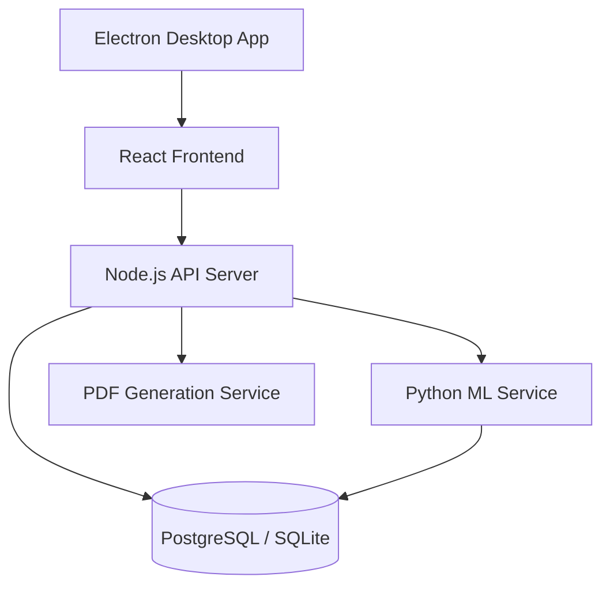

# Final Project Report: Hardware Store Management System

## 1. Executive Summary
The **Hardware Store Management System** is a comprehensive, full-stack enterprise resource planning (ERP) solution designed specifically for retail hardware environments. The system addresses critical operational challenges such as inventory accuracy, automated payroll processing, streamlined sales (POS), and data-driven decision-making through AI-driven analytics.

## 2. Technical Architecture

### 2.1 Technology Stack
- **Frontend**: React 18, Vite, Tailwind CSS, Framer Motion, Shadcn UI.
- **Backend**: Node.js, Express.js, Drizzle ORM.
- **Database**: Dual-engine support for **SQLite** (local development) and **PostgreSQL** (production scaling).
- **Desktop**: Electron (cross-platform desktop integration).
- **Containerization**: Docker & Docker Compose for modular service orchestration.
- **ML Engine**: Python-based microservice for predictive analytics.

### 2.2 System Diagram

### 2.3 Offline-First Strategy
The system implements a **Local-First** synchronization model:
- **Local DB Primary**: All transactions are written to the local PostgreSQL instance for zero-latency.
- **Sync Queue**: Changes are enqueued in a `syncQueue` table.
- **Sync Manager**: A background daemon (`syncManager.ts`) handles asynchronous data reconciliation with a remote cloud database when connectivity is available.
- **Visual Status**: Real-time "Online/Offline" indicator with a pending item count in the global Navbar.

## 3. Core Modules & Features

### 3.1 Point of Sale (POS) & CRM
- **Shift Enforcement**: Cashiers must initiate shifts with a starting float, ensuring financial accountability.
- **Transaction Flow**: Real-time cart management with SKU/barcode search and multiple payment methods (Cash, Card, Mobile, Trader).
- **Trader Account Support**: Integrated "Trader" (Trade Account) payment method that automatically updates customer AR balances and tracks credit history.
- **Loyalty Program**: Tiered customer system (Retail/Contractor) with automated point accrual and redemption.
- **Receipts**: Automated PDF receipt generation for every transaction.

### 3.2 Inventory & Product Management
- **Stock Tracking**: Real-time updates on inventory levels with low-stock visual indicators.
- **Supplier Management**: Detailed tracking of procurement sources and SKU categorization.
- **Barcode Integration**: Ready-to-use SKU system for rapid checkout.

### 3.3 Payroll & Human Resources
- **Attendance Tracking**: Clock-in/out system for employees.
- **Per-Employee Salary Configuration**: Customize basic salary, bank details (Bank Name, Account Number), and NIC directly from the Employee management interface.
- **Dynamic Payroll Engine**: Calculates base salary, overtime, and allowances based on attendance data and per-employee configurations.
- **Digital Payslips**: Automated generation of itemized payslips for staff.

### 3.4 AI-Driven Analytics (ML Service)
- **Sales Forecasting**: Time-series analysis to predict future sales volume.
- **Market Basket Analysis**: Identifies product associations (e.g., customers who buy Hammers often buy Nails) to optimize store layout and promotions.
- **RL Recommender**: Reinforcement learning-based product recommendations.
- **Seasonal Analysis**: Detects trends to optimize seasonal inventory stocking.

## 4. Key Implementation Highlights

### 4.1 UI/UX Excellence
- **High-Density Dashboard**: Optimized for desktop viewing with real-time sales widgets and clock synchronization.
- **Modern Design**: Built with a curated dark/light mode palette, glassmorphism effects, and smooth Framer Motion transitions.
- **Responsive Layout**: Sidebar-driven navigation with mobile-responsive hamburger menus for portability.

### 4.2 Robust Infrastructure
- **Containerization**: The entire stack is containerized, ensuring "it works on my machine" consistency across all environments.
- **Background Sync Daemon**: An automated reconciliation worker that ensures data integrity between local stores and the central office.
- **Seed System**: A comprehensive data seeding pipeline that populates the system with realistic data for immediate demonstration.

## 5. Security & Access Control
- **RBAC (Role-Based Access Control)**: Distinct permissions for `Admin`, `Cashier`, and `Inventory Manager`.
- **Authentication**: Secure JWT-based auth with Bcrypt password hashing.
- **Error Boundaries**: Frontend robustness ensured through React Error Boundaries to prevent total application crashes on edge cases.

## 6. Conclusion & Future Roadmap
The Hardware Store Management System provides a solid foundation for modern retail operations. Future iterations could include:
- **Advanced Analytics**: Deeper integration of ML forecasts into the ordering pipeline.
- **Hardware Integration**: Direct connection to barcode scanners and receipt printers via Electron's native API.
- **Advanced CRM**: Integrated marketing tools based on AI-identified customer segments.

---
**Report Generated on:** May 13, 2026
**Project Status:** Production Ready
