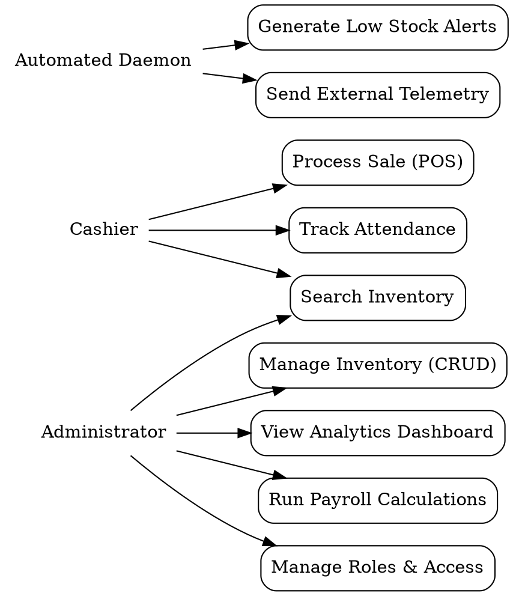
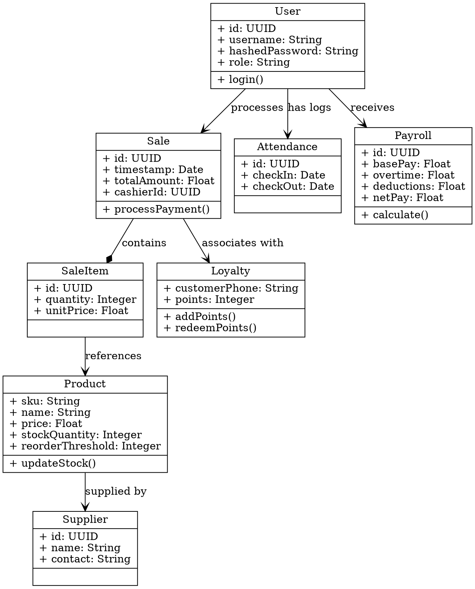
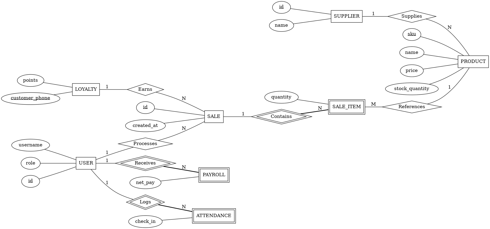
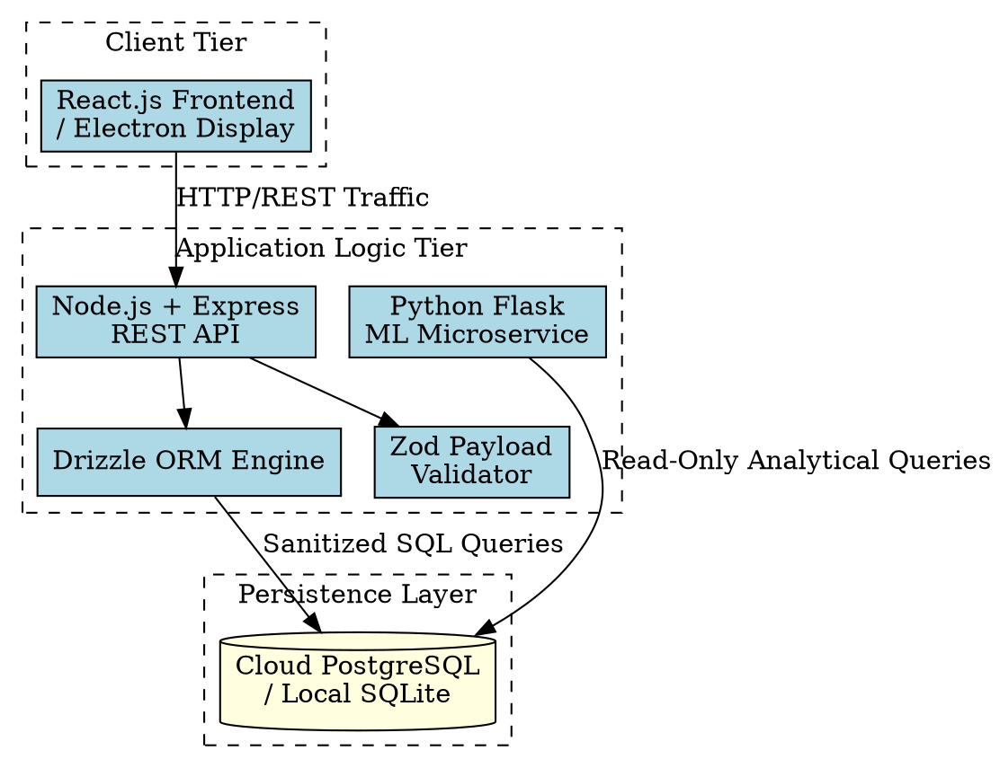
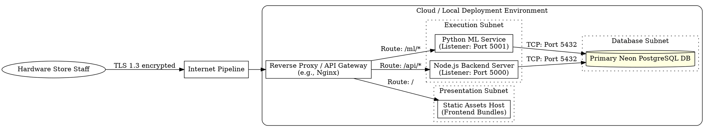

# GraphViz (DOT) Source Codes

Below are the GraphViz `dot` source codes for the requested diagrams. You can copy these and process them using the `dot` command-line tool or any online GraphViz visualizer (e.g., WebGraphviz, GraphvizOnline) to automatically draw ("drow") the images.

## 1. Use Case Diagram

## 2. Class Diagram

## 3. ER Diagram

## 4. High-Level Architecture Diagram

## 5. Networking Diagram

