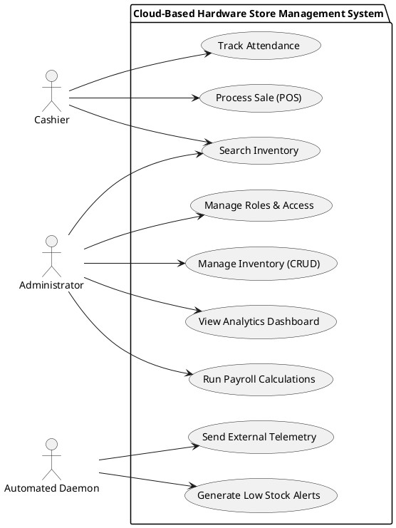
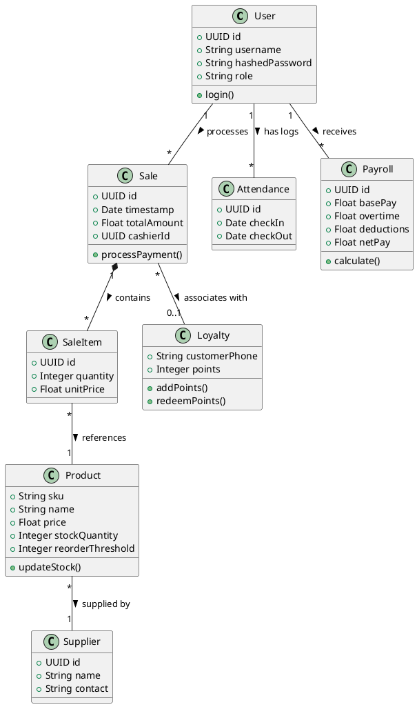
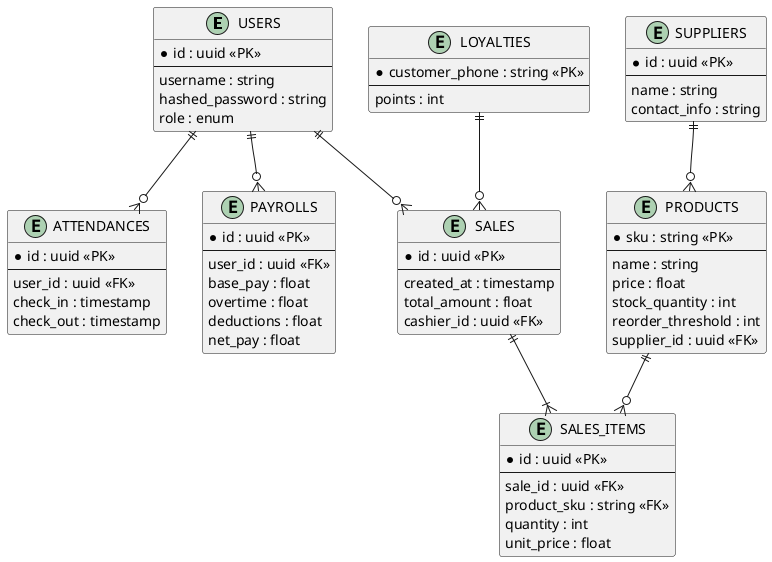
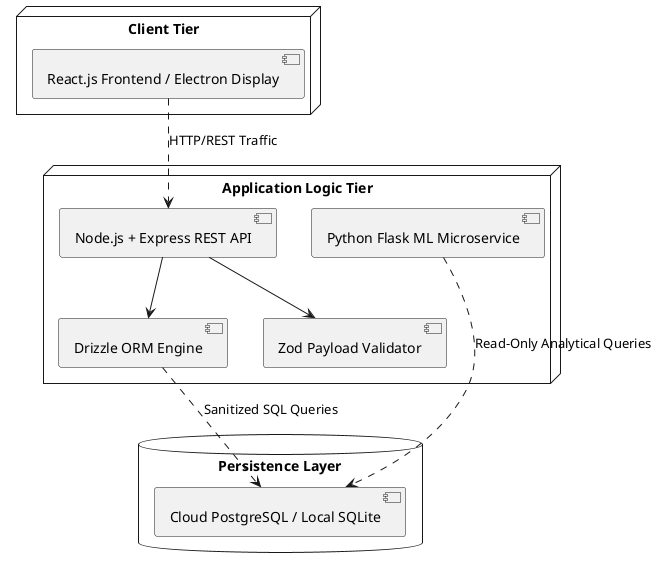
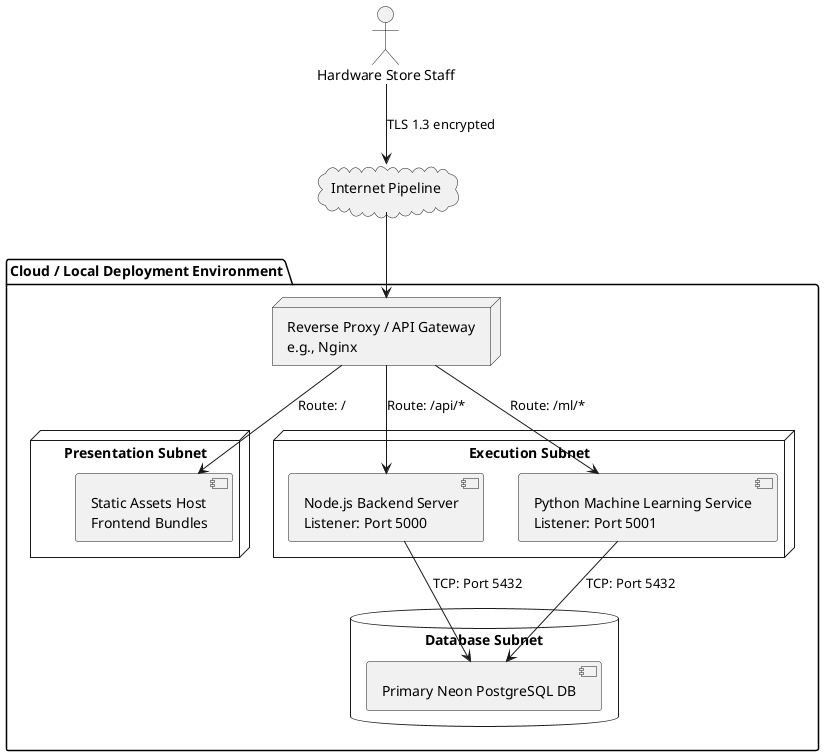

# PlantUML Source Codes

Below are the PlantUML source codes for your system diagrams. You can copy these and drop them into any PlantUML viewer, text editor extension, or university diagram tool that accepts standard `.puml` format. 

## 1. Use Case Diagram

## 2. Class Diagram

## 3. ER Diagram

## 4. High-Level Architecture Diagram

## 5. Networking Diagram

