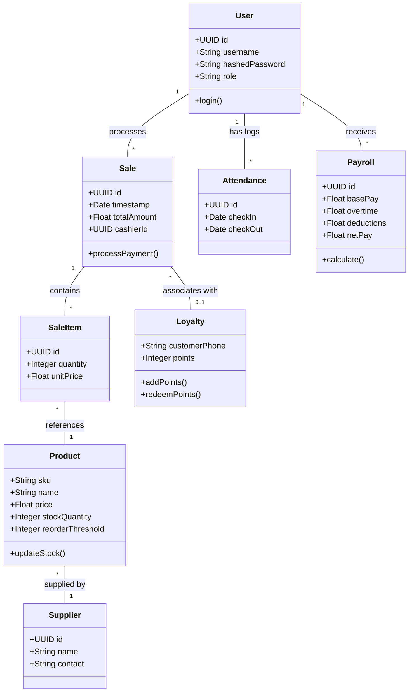
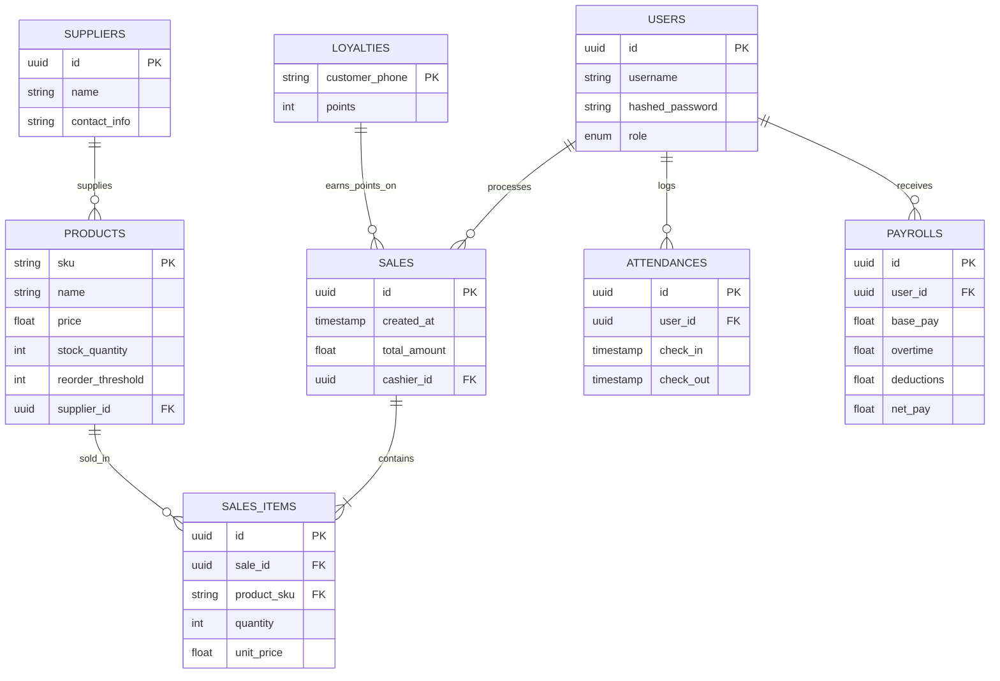
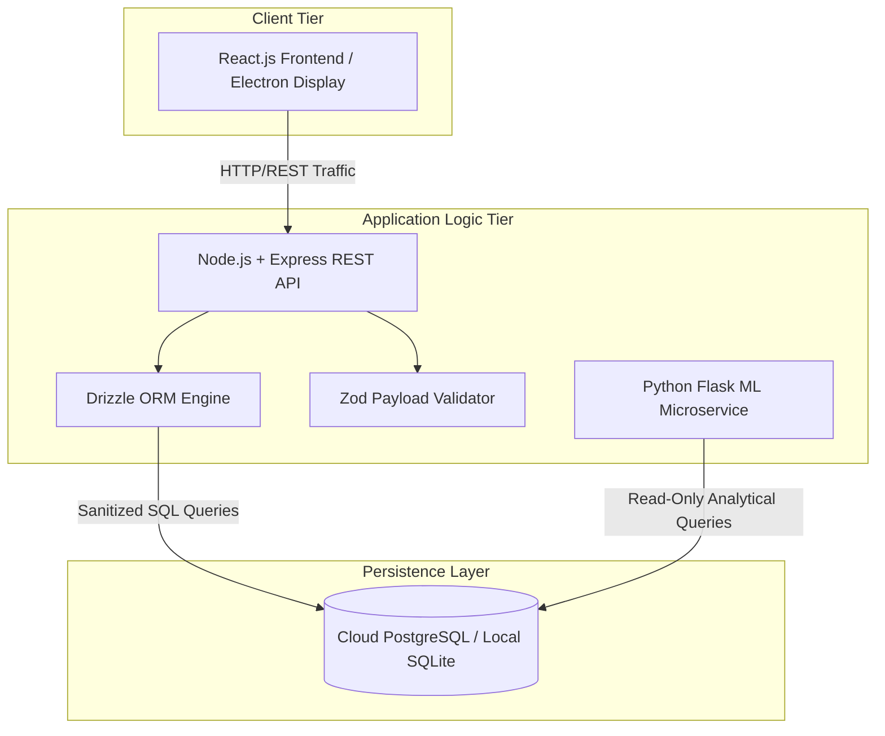
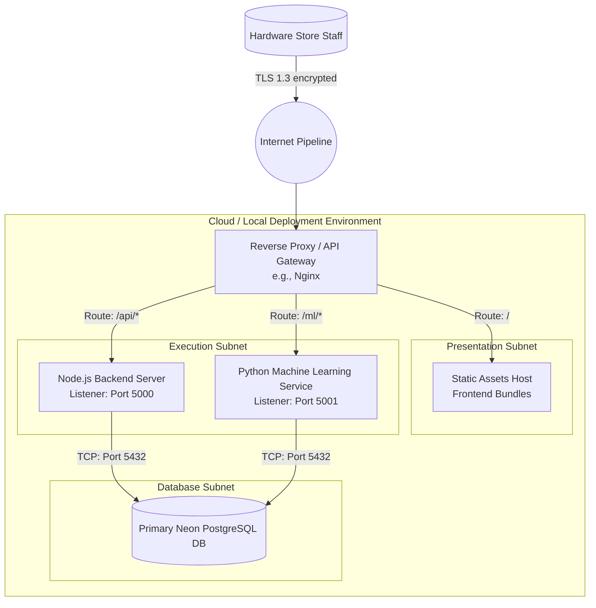

# UML & System Diagrams for the Hardware Store Management System

Below are the Mermaid.js UML codes for the diagrams explicitly outlined in your Interim Report. You can copy these code blocks into any Markdown viewer that supports Mermaid (like GitHub, Notion, or Obsidian) or use the [Mermaid Live Editor](https://mermaid.live/) to generate the images.

---

## 1. Use Case Diagram

```mermaid
actor Cashier
actor Administrator
actor "Automated Daemon" as System

package "Hardware Store Management System" {
  usecase "Process Sale (POS)" as UC1
  usecase "Search Inventory" as UC2
  usecase "Track Attendance" as UC3
  usecase "Manage Inventory (CRUD)" as UC4
  usecase "View Analytics Dashboard" as UC5
  usecase "Run Payroll Calculations" as UC6
  usecase "Manage Roles & Access" as UC7
  usecase "Generate Low Stock Alerts" as UC8
  usecase "Send External Telemetry" as UC9
}

Cashier --> UC1
Cashier --> UC2
Cashier --> UC3

Administrator --> UC2
Administrator --> UC4
Administrator --> UC5
Administrator --> UC6
Administrator --> UC7

System --> UC8
System --> UC9
```

---

## 2. Class Diagram



---

## 3. ER Diagram



---

## 4. High-Level Architecture Diagram



---

## 5. Networking Diagram


